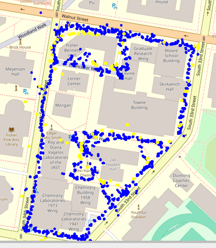

# Image_to_GPS

**CIS 4190/5190 – Img2GPS**  
*Predicting GPS Coordinates from Images*  

## Project Overview

Img2GPS trains a small convolutional neural network (CNN) to predict latitude and longitude directly from a single JPEG image. We collected ~3,500 photos around Penn’s Engineering Quad, each containing embedded EXIF GPS metadata. The workflow:

1. **EXIF Extraction & Cleaning**  
   - Load raw JPEGs from a Hugging Face dataset.  
   - Extract GPS tags (latitude, longitude) from EXIF; drop any images lacking valid GPS data.

   

   *Test data: YELLOW, Data colleted: BLUE*

2. **Data Splitting & Parquet Creation**  
   - Shuffle and split cleaned data into train (60%), validation (20%), and test (20%).  
   - Serialize each split into Parquet shards containing raw image bytes plus numeric labels.  
   - Host Parquet splits on the Hugging Face Hub for easy loading during training.

3. **Model Architecture**  
   - **Convolutional Backbone**:  
     - 3×(Conv2d → ReLU → MaxPool2d) blocks (channels: 3→16→32→64).  
   - **Fully Connected Layers**:  
     - Flatten → Dense(50 176→512) → ReLU (+ Dropout 0.3 for dropout variant) → Dense(512→128) → ReLU (+ Dropout).  
     - Final Dense(128→2) outputs `(latitude, longitude)`.

   We compare two variants:  
   - **BaselineModel**: No dropout.  
   - **DropoutModel**: Dropout(p = 0.3) after each hidden dense layer.

4. **Training & Evaluation**  
   - **Optimizer**: Adam (lr = 0.001, weight_decay = 1e-4)  
   - **Scheduler**: StepLR(γ = 0.1 every 5 epochs)  
   - **Batch Size**: 64, **Epochs**: 20  
   - **Loss**: MSE on `(lat, lon)`; evaluate geodesic RMSE (meters) via `geopy`.  
   - Save best checkpoints (`baseline_model.pt`, `dropout_model.pt`) based on validation RMSE.  
   - Final test‐time geodesic RMSE:  
     - **Baseline** ≈ 69 m  
     - **Dropout** ≈ 77 m  

## Repository Structure

```

Image\_to\_GPS/
├── CIS\_4190\_Final\_Project.ipynb    ← Model definitions, training, validation, test evaluation
├── Image\_to\_GPS.ipynb              ← Data pipeline: EXIF → Parquet splits → HF upload
├── baseline\_model.pt               ← Best baseline CNN weights
├── dropout\_model.pt                ← Best dropout‐regularized CNN weights
├── plot\_all\_location.html          ← Map plotting of train/val/test GPS points
└── README.md                       ← (This file)
````
**To run the model, simply:**

1. Clone the repository and install the required Python packages.
2. Obtain the preprocessed Parquet datasets (either by downloading from Hugging Face or by running the data‐pipeline notebook).
3. Open the “CIS\_4190\_Final\_Project.ipynb” notebook, point its dataset loader to the train/validation/test splits, and execute the cells in order to train both the baseline and dropout CNNs (each will save its best weights automatically).
4. After training finishes, load the saved checkpoint for either model, run the test‐evaluation section, and note the final geodesic RMSE on the held‐out set.

